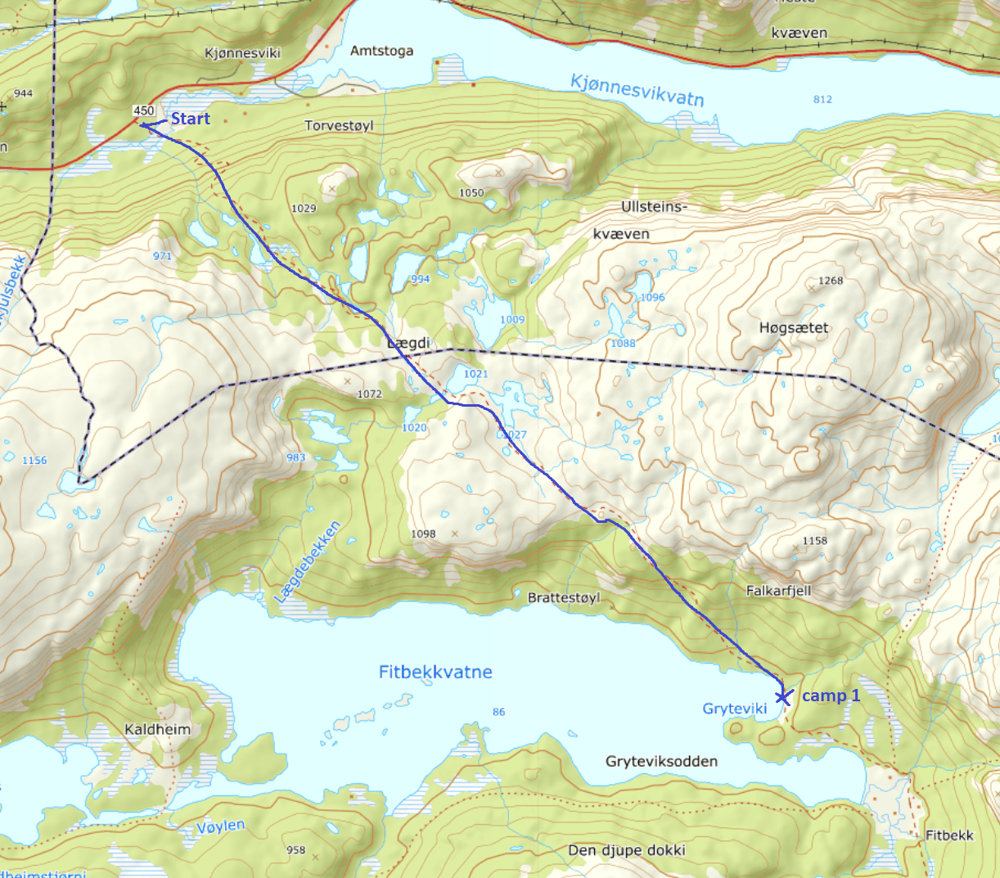
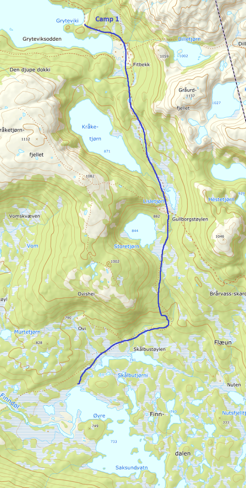
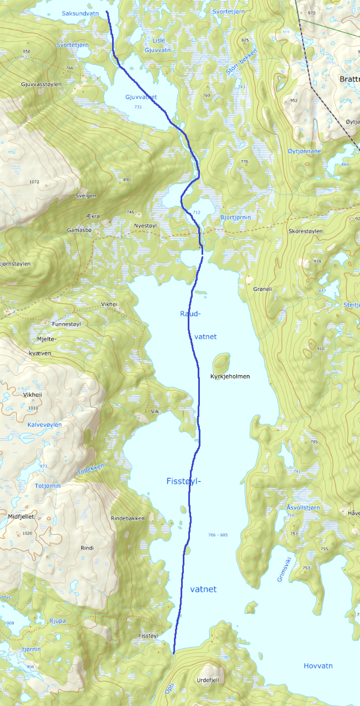
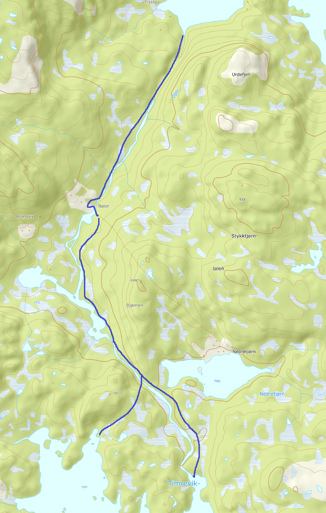
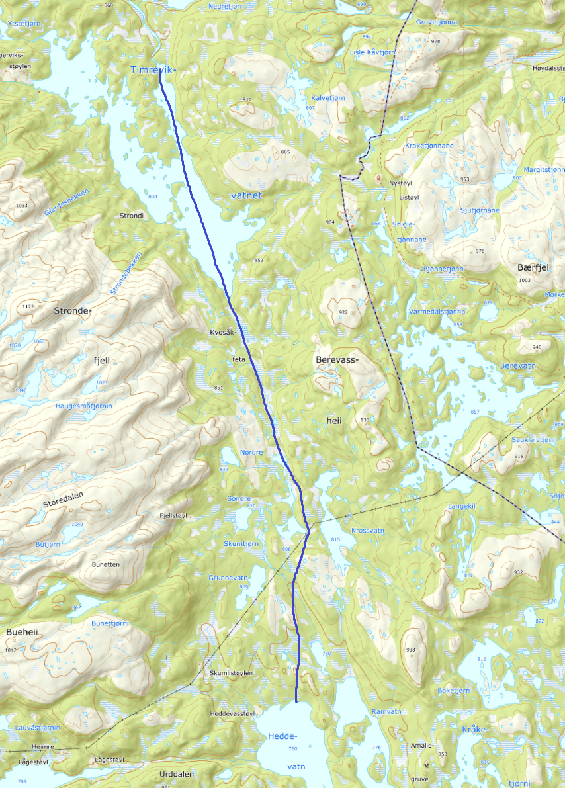
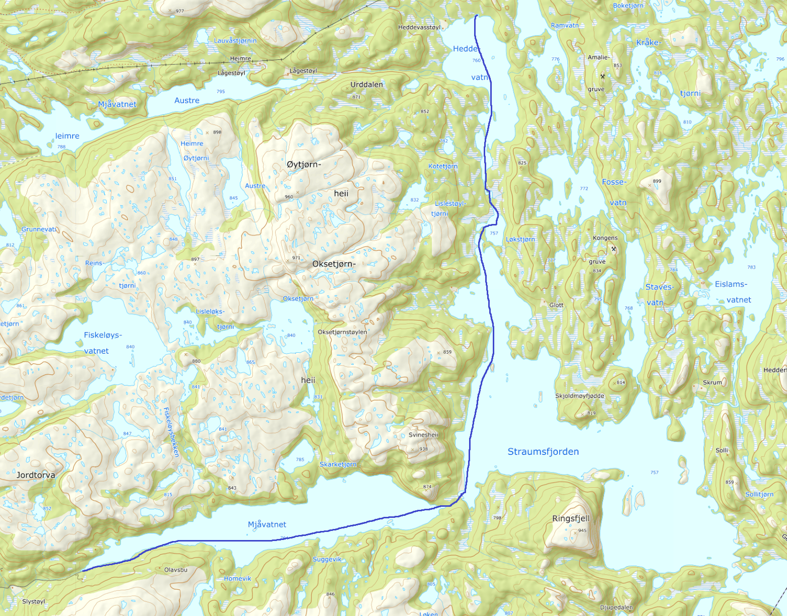

# Packraft Tur Nord for Straumsfjorden

Turen er planlagt etter samme rute Lars Monsen og Jon Almås går og paddler i Monsen på Villspor. De blir flydd inn til Øvre Saksundvatn og starter turen der. Inn dit er den det ca 9,5 km å gå fra Fv 45. Monsen bruker 3 døgn på turen.

Fra start til mål er det ca 38 km i luftlinje. ca 16,5 km er til fots, resten kan paddles.

Turen kan kanskje gjennomføres på 4 dager dersom man prioriterer fremdrift.
En hel dag ved Timrevikvatnet burde kanskje vurderes for fiske og livsnyting. 

Jeg tror denne turen gjør seg best over 5-7 dager.

[UT.no kart](https://ut.no/kart#12.81/59.31115/7.67673)

**Start** 
[59.342750, 7.618631](https://www.google.no/maps/place/59%C2%B020'33.9%22N+7%C2%B037'07.1%22E/@59.3433259,7.6166036,16.25z/data=!4m5!3m4!1s0x0:0x0!8m2!3d59.34275!4d7.618631)

Det ser ut til å være parkeringsplass ved start.

**Mål**
[59.071116, 7.651258](https://www.google.no/maps/place/59%C2%B004'16.0%22N+7%C2%B039'04.5%22E/@59.0711187,7.6490693,17z/data=!3m1!4b1!4m5!3m4!1s0x0:0x0!8m2!3d59.071116!4d7.651258)

Fra mål i Mjåvatn er det ca 7,7 km å gå ned til Straume, ved Rv 9. Beste løsning er kanksje å ha en bil stående ved start og mål.

## Del for del
### Del 1
Fra start til Gryteviki i Fitbekkvatnet er det ca 4 km på oppmerket DNT sti.
Dersom man ikke har startet sent kan man kanskje gå del 2 samme dag.

------

### Del 2
Gå videre til Øvre Saksundvatn. Det er ca 5,8 km på sti, DNT sti frem til Gullborgstøylen.
Slå leir på passende sted i Øvre Saksundvatn eller padle ned til Gjuvvatnet.

------

### Del 3
Fra Øvre Saksundvatn til enden av Fiskstøylvatnet er det ca 8 km. Fiskstøyvatnet er regulert, med en høyde på 21 m så det er usikkert hvor mye vann som er her.

------

### Del 4
Bekken eller elva fra Timrevikvatnet til Fisksøylvatnet er ca 3,5 km. Det ser ut som man kan gå opp lang denne bekken til Timreviksvatnet.

------

### Del 5
Kryssing av Timreviksvatn er ca 2,5 km. Fra sør enden av Timreviksvatnet til Heddevatn er det en gåetappe på ca 4 km.
Alternativ rute via Berevatn til øst.

------

### Del 6
Fra Nordenden av Heddevatn til veien i enden av Mjåvatn, via Straumsfjorden er det ca 9 km.
Alternativ rute er via Fossevatn øst for tegnet rute.

